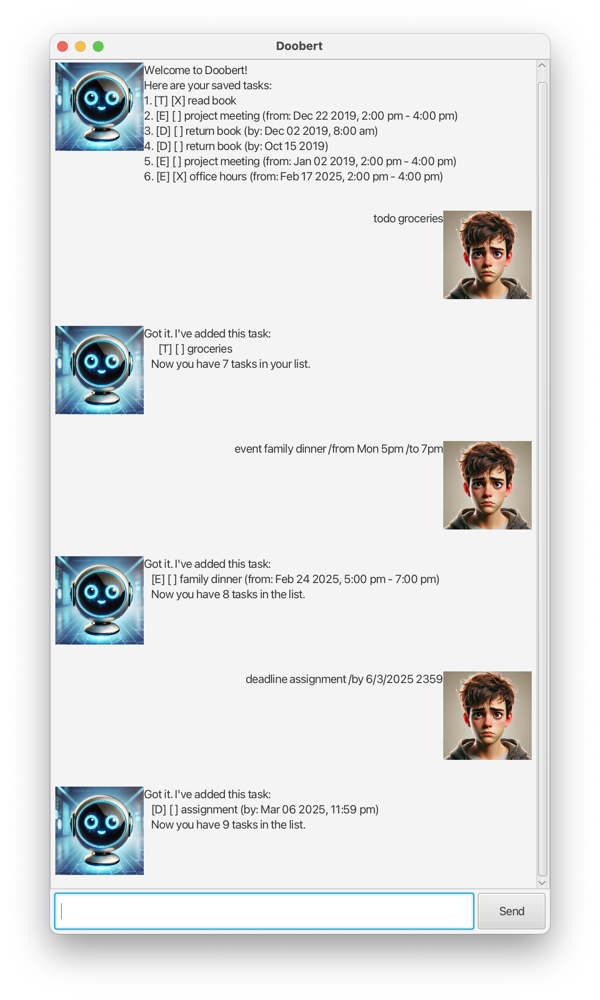

# Doobert User Guide




Doobert chatbot is a Graphical User Interface (GUI) application available for every user who needs to 
simplify their life **by tracking their daily tasks** without the need to constantly worry about deadlines.

## Adding deadlines
Type the task and deadline due to add the task to the list.

Format: `deadline <description> /by <Date or Day due> <time>`  
Tip: Time is optional  
Examples:  
- `deadline return book /by Sunday`
- `deadline return book /by 22/12/2019 1800`


```
Got it. I've added this task:
   [D] [ ] return book (by: Feb 02 2025)
   Now you have 2 tasks in the list.
```

## Adding events
Format: `event <description> /from <Date> <time> /to <time>`  
Examples:  
- `event project meeting /from 2025-12-22 1400 /to 1600`
- `event meetup /from 2pm /to 4pm`


```
Got it. I've added this task:
   [E] [ ] project meeting (from: Mon 2pm-4pm)
   Now you have 3 tasks in the list.
```

## Adding todo tasks
Format: `todo <description>`  
Example:  
- `todo buy groceries` 


```
Got it. I've added this task: 
      [T] [ ] buy groceries
   Now you have 1 tasks in your list.
```

## Marking tasks
To mark a task as completed.  
Format: `mark <index>`  
Example:
- `mark 1`


```
Nice! I've marked this task as done: 
   [X] buy groceries
```

## Unmark tasks
To unmark a task that was previously marked.    
Format: `unmark <index>`  
Example:
- `unmark 1` 


```
OK, I've marked this task as not done yet:
   [] buy groceries
```

## List all tasks
Displays all tasks saved in a list.  
Format: `list`  


```
Here are the tasks in your list:
   1. [T] [ ] borrow book
   2. [D] [ ] return book (by: Feb 02 2025)
   3. [E] [ ] project meeting (from: Mon 2pm-4pm)
   4. [E] [ ] read (from: 2pm-4pm)
```

## Finding tasks
Finds tasks contained in task list based on description.  
Format: `find <description>`  
Example:
- `find return book`

```
Here are the matching tasks in your list:
1. [D] [ ] return book (by: Feb 02 2025)
```